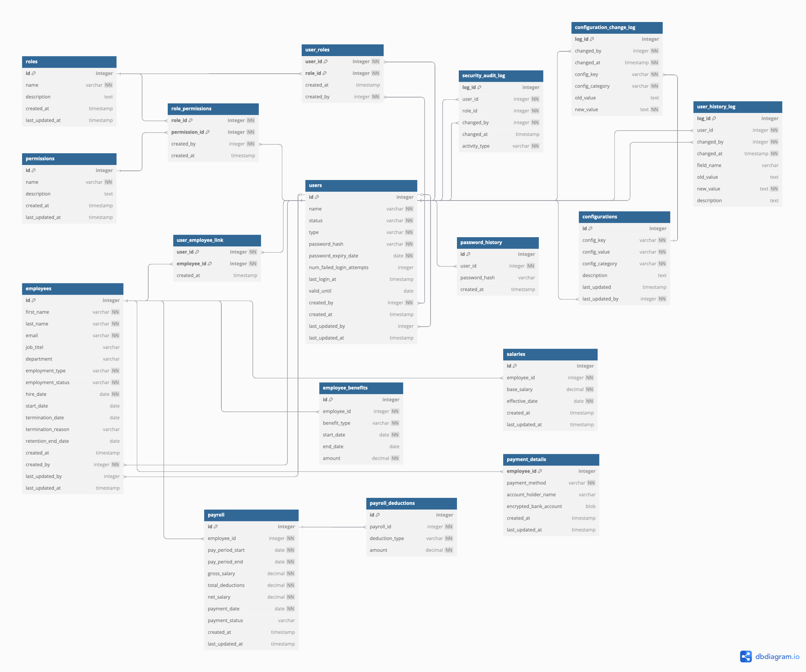

### Database Schema

#### Overview of the relational data model and database schema for the ERP-System's MySQL Database*

**ER-Diagramm**



**SQL code for creating the database schema:**

```sql
/* ------------ Users, Roles and Permissions (User Administration Modul) ------------------ */
CREATE TABLE roles (
    id INT PRIMARY KEY AUTO_INCREMENT,
    name VARCHAR(255) UNIQUE NOT NULL,
    description TEXT,
    created_at TIMESTAMP DEFAULT CURRENT_TIMESTAMP,
    last_updated_at TIMESTAMP DEFAULT CURRENT_TIMESTAMP ON UPDATE CURRENT_TIMESTAMP
);

CREATE TABLE permissions (
    id INT PRIMARY KEY AUTO_INCREMENT,
    name VARCHAR(255) NOT NULL,
    description TEXT,
    created_at TIMESTAMP DEFAULT CURRENT_TIMESTAMP,
    last_updated_at TIMESTAMP DEFAULT CURRENT_TIMESTAMP ON UPDATE CURRENT_TIMESTAMP
);


CREATE TABLE users (
    id INT PRIMARY KEY AUTO_INCREMENT,
    name VARCHAR(50) UNIQUE NOT NULL,
    status ENUM('ACTIVE', 'LOCKED', 'DEACTIVATED') NOT NULL DEFAULT 'ACTIVE',
    /*
        - ACTIVE: User can log in and use the system.
        - LOCKED: User is temporarily blocked (e.g., failed logins, security issues).
        - DEACTIVATED: Soft delete -> User cannot log in, and role mappings are removed.
    */
    type ENUM('NORMAL', 'ADMIN', 'SYSTEM') NOT NULL DEFAULT 'NORMAL',
    password_hash VARCHAR(255) NOT NULL,
    password_expiry_date DATE NOT NULL,
    num_failed_login_attempts INT DEFAULT 0,
    last_login_at TIMESTAMP DEFAULT NULL,
    valid_until DATE DEFAULT NULL,
    created_by INT NOT NULL DEFAULT 1, -- Default to System user (user_id = 1)
    created_at TIMESTAMP DEFAULT CURRENT_TIMESTAMP,
    last_updated_by INT DEFAULT NULL,
    last_updated_at TIMESTAMP DEFAULT NULL ON UPDATE CURRENT_TIMESTAMP,
    FOREIGN KEY (created_by) REFERENCES users(id) ON DELETE RESTRICT,
    FOREIGN KEY (last_updated_by) REFERENCES users(id)
);

-- table for managing permissions per role
CREATE TABLE role_permissions (
    role_id INT NOT NULL,
    permission_id INT NOT NULL,
    created_by INT NOT NULL,
    created_at TIMESTAMP DEFAULT CURRENT_TIMESTAMP,
    PRIMARY KEY (role_id, permission_id),
    FOREIGN KEY (role_id) REFERENCES roles(id),
    FOREIGN KEY (permission_id) REFERENCES permissions(id),
    FOREIGN KEY (created_by) REFERENCES users(id)
);

-- table for managing user access rights
CREATE TABLE user_roles (
    user_id INT NOT NULL,
    role_id INT NOT NULL,
    created_at TIMESTAMP DEFAULT CURRENT_TIMESTAMP,
    created_by INT NOT NULL,
    PRIMARY KEY (user_id, role_id),
    FOREIGN KEY (user_id) REFERENCES users(id),
    FOREIGN KEY (role_id) REFERENCES roles(id), 
    FOREIGN KEY (created_by) REFERENCES users(id)
);

/* ------------------------------ System Administraion ------------------------------- */
CREATE TABLE configurations  (
    id INT AUTO_INCREMENT PRIMARY KEY,
    config_key VARCHAR(255) UNIQUE NOT NULL,
    config_value VARCHAR(255) NOT NULL,
    config_category ENUM(
        'PASSWORD_SETTINGS', 
        'EMAIL_SETTINGS', 
        'SECURITY_SETTINGS', 
        'SYSTEM_SETTINGS'
    ) NOT NULL,
    description TEXT,
    last_updated TIMESTAMP DEFAULT CURRENT_TIMESTAMP ON UPDATE CURRENT_TIMESTAMP,
    last_updated_by INT NOT NULL,
    FOREIGN KEY (last_updated_by) REFERENCES users(id)
);

/* ------------------------ Change Logging / Audit-Logs ------------------------------ */

CREATE TABLE security_audit_log (
    log_id INT PRIMARY KEY AUTO_INCREMENT,
    user_id INT NOT NULL,
    role_id INT NOT NULL,
    changed_by INT NOT NULL,
    changed_at TIMESTAMP DEFAULT CURRENT_TIMESTAMP,
    activity_type ENUM('ROLE_ASSIGNED', 'ROLE_REMOVED') NOT NULL,
    FOREIGN KEY (user_id) REFERENCES users(id),
    FOREIGN KEY (changed_by) REFERENCES users(id)
);

CREATE TABLE user_history_log (
    log_id INT PRIMARY KEY AUTO_INCREMENT,
    user_id INT NOT NULL,
    changed_by INT NOT NULL,
    changed_at TIMESTAMP NOT NULL,
    field_name ENUM(
        'user_status', 
        'is_verified', 
        'password_hash', 
        'num_failed_login_attempts', 
        'last_login_at', 
        'valid_until'
    ) DEFAULT NULL,
    old_value TEXT DEFAULT NULL,
    new_value TEXT NOT NULL,
    description TEXT DEFAULT NULL,
    FOREIGN KEY (user_id) REFERENCES users(id),
    FOREIGN KEY (changed_by) REFERENCES users(id)
);

CREATE TABLE configuration_change_log (
    log_id INT PRIMARY KEY AUTO_INCREMENT,
    changed_by INT NOT NULL,
    changed_at TIMESTAMP NOT NULL,
    config_key VARCHAR(255) NOT NULL,
    config_category VARCHAR(255) NOT NULL,
    old_value TEXT DEFAULT NULL,
    new_value TEXT NOT NULL,
    FOREIGN KEY (changed_by) REFERENCES users(id),
    FOREIGN KEY (config_key) REFERENCES configurations(config_key)
);

/*------------ Employee, Payroll, Salary and Benefits (HR Operations) -------------------*/

-- table to store essential employee information and personal data
CREATE TABLE employees (
    id INT PRIMARY KEY AUTO_INCREMENT,
    first_name VARCHAR(50) NOT NULL,
    last_name VARCHAR(50) NOT NULL,
    email VARCHAR(255) NOT NULL,
    job_titel VARCHAR(100),
    department VARCHAR(100),
    employment_type ENUM('FULL_TIME', 'PART_TIME', 'INTERN') NOT NULL,
    employment_status ENUM('ACTIVE', 'TERMINATED', 'RESIGNED', 'RETIRED', 'ON_LEAVE', 'SUSPENDED') NOT NULL,
    hire_date DATE NOT NULL,
    start_date DATE DEFAULT NULL,
    termination_date DATE DEFAULT NULL,
    termination_reason ENUM('Resignation', 'Dismissal', 'End of Contract', 'Retirement'),
    retention_end_date DATE DEFAULT NULL,
    created_at TIMESTAMP DEFAULT CURRENT_TIMESTAMP,
    created_by INT NOT NULL,
    last_updated_by INT DEFAULT NULL,
    last_updated_at TIMESTAMP DEFAULT CURRENT_TIMESTAMP ON UPDATE CURRENT_TIMESTAMP,
    FOREIGN KEY (created_by) REFERENCES users(id),
    FOREIGN KEY (last_updated_by) REFERENCES users(id)
);

-- table to store historical payroll data
CREATE TABLE payroll (
    id INT PRIMARY KEY AUTO_INCREMENT,
    employee_id INT NOT NULL,
    pay_period_start DATE NOT NULL,
    pay_period_end DATE NOT NULL,
    gross_salary DECIMAL(10,2) NOT NULL,
    total_deductions DECIMAL(10,2) NOT NULL,
    net_salary DECIMAL(10,2) NOT NULL,
    payment_date DATE NOT NULL,
    payment_status ENUM('PENDING', 'PROCESSED', 'FAILED') DEFAULT 'PENDING',
    created_at TIMESTAMP DEFAULT CURRENT_TIMESTAMP,
    last_updated_at TIMESTAMP DEFAULT CURRENT_TIMESTAMP ON UPDATE CURRENT_TIMESTAMP,
    FOREIGN KEY (employee_id) REFERENCES employees(id) ON DELETE CASCADE
);

-- table to keep track of employee salaries and adjustments over time
CREATE TABLE salaries (
    id INT PRIMARY KEY AUTO_INCREMENT,
    employee_id INT NOT NULL,
    base_salary DECIMAL(10,2) NOT NULL,
    effective_date DATE NOT NULL,
    created_at TIMESTAMP DEFAULT CURRENT_TIMESTAMP,
    last_updated_at TIMESTAMP DEFAULT CURRENT_TIMESTAMP ON UPDATE CURRENT_TIMESTAMP,
    FOREIGN KEY (employee_id) REFERENCES employees(id) ON DELETE CASCADE
);

-- table to store payroll deductions like taxes, benefits, etc.
CREATE TABLE payroll_deductions (
    id INT PRIMARY KEY AUTO_INCREMENT,
    payroll_id INT NOT NULL,
    deduction_type ENUM('TAX', 'INSURANCE', 'PENSION', 'OTHER') NOT NULL,
    amount DECIMAL(10,2) NOT NULL,
    FOREIGN KEY (payroll_id) REFERENCES payroll(id) ON DELETE CASCADE
);

-- table to store employees payment info
CREATE TABLE payment_details (
    employee_id INT PRIMARY KEY,
    payment_method ENUM('BANK_TRANSFER', 'CHECK') NOT NULL,
    account_holder_name VARCHAR(255) DEFAULT NULL,
    encrypted_bank_account VARBINARY(255) DEFAULT NULL,  -- Store encrypted bank account number (EU: IBAN)
    created_at TIMESTAMP DEFAULT CURRENT_TIMESTAMP,
    last_updated_at TIMESTAMP DEFAULT CURRENT_TIMESTAMP ON UPDATE CURRENT_TIMESTAMP,
    FOREIGN KEY (employee_id) REFERENCES employees(id) ON DELETE CASCADE
);

CREATE TABLE employee_benefits (
    id INT PRIMARY KEY AUTO_INCREMENT,
    employee_id INT NOT NULL,
    benefit_type ENUM('HEALTH_INSURANCE', 'PENSION', 'PAID_LEAVE', 'OTHER') NOT NULL,
    start_date DATE NOT NULL,
    end_date DATE DEFAULT NULL,
    amount DECIMAL(10,2) NOT NULL,
    FOREIGN KEY (employee_id) REFERENCES employees(id) ON DELETE CASCADE
);


-- table for the mapping of employees to user accounts
CREATE TABLE user_employee_link (
    user_id INT NOT NULL,
    employee_id INT NOT NULL,
    created_at TIMESTAMP DEFAULT CURRENT_TIMESTAMP,
    PRIMARY KEY (user_id, employee_id),
    FOREIGN KEY (user_id) REFERENCES users(id),
    FOREIGN KEY (employee_id) REFERENCES employees(id)
);

/* ---------------- Transactions, General Ledger, Controlling (Finance Modul) -------------------- */
